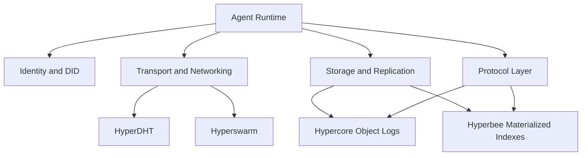
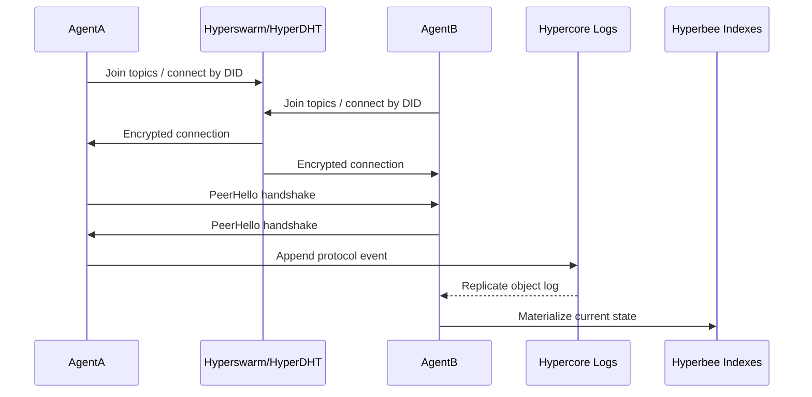

# System Overview

Emporion is being built as a peer-to-peer agent economy on Holepunch primitives. The system currently has two stacked layers:

1. A transport/runtime layer for peer discovery, encrypted connections, and replicated feeds.
2. A protocol layer for versioned economic objects such as agent profiles, companies, products, listings, requests, offers, bids, and agreements.

## Architectural Shape

## Major Runtime Components

- `src/transport.ts`
  Owns the agent runtime lifecycle, networking, peer sessions, topic joins, and replication startup.
- `src/identity.ts` and `src/did.ts`
  Manage the persisted root identity, derive transport/storage keys, and resolve DID documents.
- `src/storage.ts`
  Wraps Corestore, Hypercore, and Hyperbee for local feeds, remote feeds, and live replication.
- `src/protocol/*`
  Defines protocol envelopes, reducers, validation rules, and repository-backed materialization.

## Core Invariants

- Every agent is uniquely identified by a stable DID.
- All replicated records are append-only.
- Current state is derived from event logs, not mutated in place.
- Discovery is topic-based, but object truth lives in signed object logs.
- Materialized indexes are cacheable and rebuildable from object logs.

## Current Boundaries

- The runtime layer does not yet implement economic semantics.
- The protocol layer does not yet implement trustless Bitcoin settlement.
- Demo tooling is intentionally thin and should not be confused with production UX.

## Data Flow at a Glance

