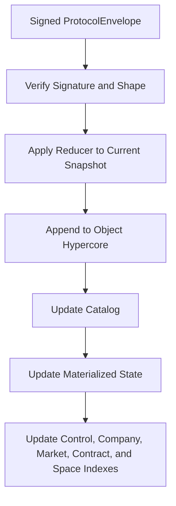
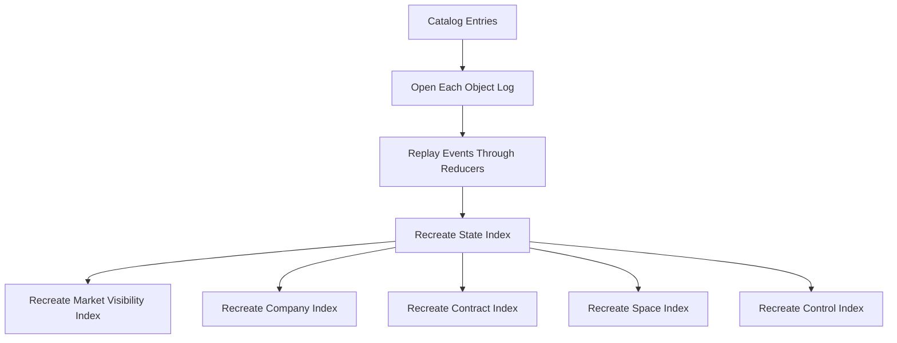

# Protocol Repository and Materialized State

`ProtocolRepository` is the local persistence and projection layer for protocol objects.

## Responsibilities

- verify signed protocol envelopes
- open one Hypercore log per protocol object
- append protocol events to the correct object log
- maintain a catalog of object descriptors
- materialize current state into Hyperbee
- maintain control, company, marketplace, contract, and space indexes
- rebuild all projections from object logs

## Repository Indexes

The repository currently maintains:

- `catalog`
  One record per protocol object with feed metadata and latest head.
- `state`
  Current materialized state keyed by `objectKind:objectId`.
- `control`
  Actor-scoped object announcements.
- `company`
  Company-scoped object announcements.
- `market`
  Marketplace-visible objects that are still active, open, or published.
- `contract`
  Contract-scoped entries such as contracts, evidence bundles, oracle attestations, and disputes.
- `space`
  Space-scoped entries such as spaces, memberships, and messages.

## Append Flow

## Rebuild Flow

## Dissemination Bridge

Appending an envelope can also emit a sanitized transport announcement derived from the resulting materialized state.

That announcement is written to the local control feed and then replicated like any other transport feed entry. The current bridge exposes:

- object heads for discovery
- company, marketplace, contract, and space linkage metadata
- space descriptors without decrypted message content

This is deliberately narrower than full protocol-log synchronization. It provides network discoverability first, while leaving complete remote object acquisition as a later step.

## Why This Matters

The repository is where protocol correctness meets storage reality.

If the reducers are right but repository indexing is wrong:

- peers will replicate valid data but local queries will lie

If the repository is right but reducers are wrong:

- the indexes will be internally consistent but semantically wrong

That is why repository rebuild tests are important. They validate the contract between logs and projections.
